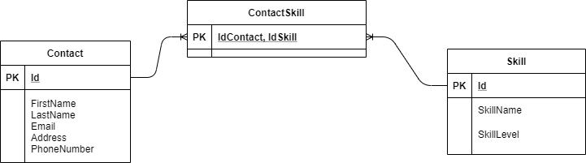

# API_Contacts

An ASP.Net Core API to manage contacts resources.

A contact is described by the following attributes:
* FirstName
* LastName
* FullName
* Address
* Email
* PhoneNumber

Each contact can have several skills, and each skill can correspond to several contacts. 

A skill is described by the following attributes:
* SkillName
* SkillLevel

A SQLite database is used to manage the resources. The contact table and skill table are link using a contactskill table (relationship "many-to-many"):

A swagger generator is implemented with SwashBuckle. The launch Url of the app points to the Swagger UI. 
